# Contributing to readmerlin

Everything the README leaves out lives here: commands, settings, workflows, badge recipes, how the pieces fit, and the block an agent reads.

## How it ships

readmerlin is an agent skill, not a package. The writing needs the user's agent, and an agent finds a skill in its skills folder, so the skill folder is the whole product. The rules that thinking cannot settle, such as whether a link answers, run from one script inside that folder: `skills/readmerlin/scripts/readmerlin.mjs`, built from `src`, committed, and held to the source by a rebuild test. The hero graphic is figurehead's job, not this repo's: figurehead draws a hero from its spec, as a peer skill installed beside this one. A release is a merge to main with the version bumped in `package.json` and in SKILL.md together. The update notice reads the version from `package.json` on main, and a test holds the two files and the script to the same number. Nothing is published to npm.

```text
npx skills add oficiallyAkshay/readmerlin -g
npx skills update readmerlin
```

Installs are clones of this repository, so clonometer keeps the count. The script tells the user when a newer version is out and never updates anything itself.

## Commands

With `readmerlin` standing for `node skills/readmerlin/scripts/readmerlin.mjs`, see [the docs index](../docs/README.md) for `context`, `rules`, `check` and `init-workflow`: their arguments, flags and defaults, their exit codes, and their output formats, each with one example command line.

## Settings

All in `readmerlin.json`, described by `readmerlin.schema.json`. See [the settings reference](../docs/reference/settings.md) for every key and its default, and [Keep it true](../docs/guides/keep-it-true.md) for what the check sends over the network, what the action runs on the runner, and the guard for each.

## Workflows

`init-workflow` writes `.github/workflows/readme-check.yml`, which runs the rules on every push, pull request and once a week through the action. The action runs the script the skill carries from its own checkout, so the commit a workflow pins is exactly the code that runs. Pin a commit of main; `init-workflow` fills in the current one. It only checks; the writing is the agent's job.

For a repo with no registry package, clones are the only count there is. `init-workflow --clones` also writes `.github/workflows/clonometer.yml`, the consumer workflow of [clonometer](https://github.com/oficiallyAkshay/clonometer) pinned to its current commit. It needs a `TRAFFIC_TOKEN` secret: a fine-grained token scoped to the one repository, with Contents write and Administration read. A private repository needs clonometer's gist storage instead, set by hand from its README, since the branch's numbers file is not public.

This repo's own `.github/workflows/ci.yml` runs a `checks` job that scans the full history for secrets, a `test` job that runs the node matrix, typecheck, build, the test suite and the self check, and a `ci` gate job that needs both and only passes when every job it needs succeeded. Branch protection requires only the `ci` job, so that gate is the one check to keep green. Dependabot, configured in `.github/dependabot.yml`, opens weekly pull requests for GitHub Actions and for npm dependencies so the workflow pins and dev tooling do not go stale.

## Badge recipes

After the first clonometer run, the numbers sit on the `badges` branch. Replace owner and repo, then add the scheme:

```text
https://img.shields.io/badge/dynamic/json?url=https://raw.githubusercontent.com/<owner>/<repo>/badges/clones.json&query=$.badge&label=clones&logo=github&logoColor=white
https://img.shields.io/badge/dynamic/json?url=https://raw.githubusercontent.com/<owner>/<repo>/badges/views.json&query=$.badge&label=views&logo=github&logoColor=white
```

A count badge such as `downloads-1.2k` needs a source in `readmerlin.json` under `counts`, keyed by the badge label, holding a command that prints the number.

## How it fits together

<p align="center">
  
</p>

Code gathers and checks. The agent does the writing. The diagram is rebuilt with `node scripts/archify-svg.mjs <archify checkout>` from `assets/diagram/architecture.archify.json`, using [Archify](https://github.com/tt-a1i/archify).

## The hero

This repo carries no renderer of its own. figurehead, a peer skill installed with `npx skills add oficiallyAkshay/figurehead`, draws a hero from its spec, with no dependencies, in light and dark theme. It renders two layouts: `fan` for a product that gathers many things into one, and `before-after` for a product that makes one thing better. This repo's own hero uses a third layout, `pages`, for a repo that feeds several pages to different readers; figurehead does not render that layout yet, so this repo's hero has no working renderer until it does. `test/hero.test.ts` renders every committed hero through figurehead when `FIGUREHEAD_DIR` names a checkout, or a sibling `../figurehead` one, and fails when an SVG has drifted from its spec; it skips, naming the env var, when neither is found. `visuals/spec-agrees` fails a hero that does not show every label its spec names. A new verb gets a new layout in figurehead, never a borrowed one.

## Specs beside an SVG

`visuals/spec-beside` accepts `<name>.hero.json` for a hero, `<name>.archify.json`, `<name>.d2` or `<name>.mmd` for a diagram, and any other `<name>.json`. It checks the hero spec's labels and only looks for the rest.

## Working on the code

```bash
npm ci
npm run typecheck
npm run build
npm test
npm run check
```

Rules live in `src/check/rules`, a few groups per file; the id prefix names the group. A rule has an id of the form `group/name`, a default level, a one-line description and a `run` that returns findings with a repair line. Add a test beside the others in `test`, update the rule count in `test/skill-script.test.ts` and in RULES.md wherever it appears, and commit the rebuilt script: `npm run build` writes it, and the tests fail while it is stale.

Things learned the hard way:

- `process.exit()` after a large stdout write truncates piped output at 64 KB. Set `process.exitCode` and let stdout drain.
- tsup `noExternal: [/.*/]` overrides `external`. The bundle is one file with everything inlined so the installed skill runs with Node alone.
- Archify delivers HTML with the stylesheet in the page head. The SVG needs that CSS inlined inside CDATA or it renders black. Boundaries accept only `region` and `security-group`, and labels on short edges overlap, so they are dropped.
- shields has no logo for cursor or openai. A label-only host badge is allowed.
- A composite action does not see a secret unless the step sets it. `npx -y pkg` never installs optional peers.
- An adversarial review before each release has found defects that every test passed. Fan reviewers out by area and have judges confirm each finding before fixing it.

## What the shape learned

- A README is judged by a person in a minute and read in full by an agent. The person gets the README; the agent gets CONTRIBUTING and docs, kept true together on every merge.
- Value stated as a mechanism is not value. "57 rules" says nothing until it says "read in a minute".
- Scope, proof and limits are each worth their own section: Fit for who it is for, In action for a real result, Security and limits for the credential, the checklist and the defaults together.
- A hero is designed before it is diagrammed: a headline that states the value earns more attention than a bigger picture.
- Badges earn their place by adoption and licence. A language version or a rule count is not a fact a reader acts on.

## For agents

- Skill path: `skills/readmerlin/SKILL.md`. Install with the skills CLI or copy the folder.
- Reference: `docs/` holds a guide per workflow and a reference page per command, read in full alongside this file.
- Order of work: `context`, `rules`, scope the Fit lists, find the In action result, draw the hero with figurehead, write the parts in order, compare truthfully, move the rest here, write the docs pages, `check` until clean, `init-workflow`.
- Rule ids read `group/name`: `hero/exists`, `shape/earned-headings`, `badges/carry-facts`, `prose/plain-punctuation`, `visuals/spec-beside`, `privacy/denylist-clear`, `links/external`. Every finding carries the id and a repair line.
- The script is `skills/readmerlin/scripts/readmerlin.mjs`. Edit `src`, never the script, then run the build.
- Peers, never dependencies: figurehead draws the hero from `<name>.hero.json`; this skill carries no renderer of its own. Archify draws the diagram from `<name>.archify.json`. Both specs sit beside their SVG, and `check` refuses an SVG without one.
