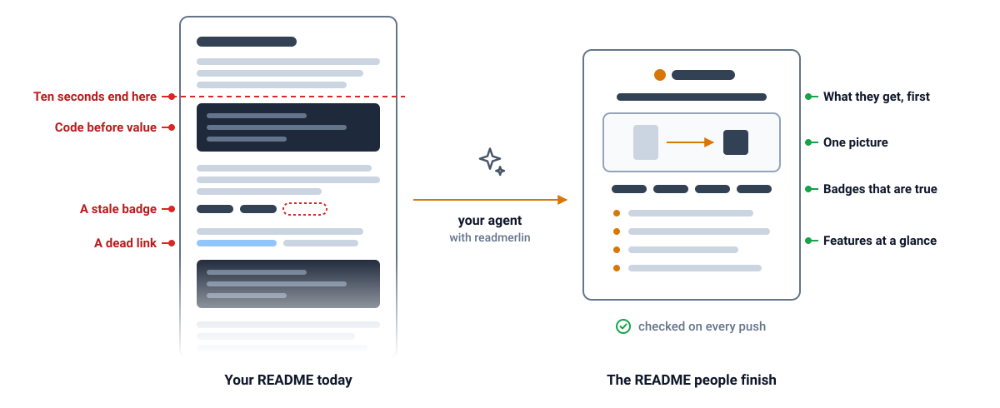

<h1 align="center">🧙 readmerlin</h1>

  <b>A skill README gets ten seconds and then goes stale. readmerlin writes one people finish and checks it on every push.</b>

  
  
  
  
  

  <b><a href="examples/tidy-inbox/README.md">See a README it wrote</a></b>

readmerlin is a skill for Claude Code, Cursor, Codex, Gemini CLI and Copilot, and also a command line tool, a GitHub Action and a library. The skill writes the page with the agent you already run. The other three check any README, and the action can write one on the runner.

Add the oficiallyAkshay/readmerlin skill to your agent and ask it for a README, or add the action of the same name to a workflow. Neither needs a secret.

## Features

- 🎯 **Value comes first.** The page opens on what the reader gets, never on how it is built.
- ✍️ **Your words stay.** It keeps your sentences and restructures around them.
- 🏷️ **Badges stay true.** Every badge links somewhere, its logo renders, and a number is tied to a command that prints it.
- 🔒 **Private stays private.** Emails, home paths, keys and your own hashed word list stop the run.
- ✂️ **One shape holds.** Six parts in one order, said in plain sentences.
- 📦 **Packages get badges.** Every package the repo publishes carries its registry version and downloads.
- 🎛️ **Rules, your way.** Every rule is off, warn or fail in one small JSON file.

## Security

The check needs no credential; the writer uses the model login or key you already have, sent only to the backend you choose.

- ❌ reads your source tree
- ❌ sends your files anywhere when you only check
- ❌ sends source files to the model, only manifests, commands and the old README
- ❌ runs commands from your config on a CI runner unless you switch that on
- ❌ names a word from your hashed denylist in its output
- ❌ sends telemetry

## How it compares

| | [oficiallyAkshay/readmerlin](https://github.com/oficiallyAkshay/readmerlin) | [eli64s/readme-ai](https://github.com/eli64s/readme-ai) | [DavidAnson/markdownlint](https://github.com/DavidAnson/markdownlint) | [lycheeverse/lychee](https://github.com/lycheeverse/lychee) |
| --- | --- | --- | --- | --- |
| README writer | ✅ | ✅ | ❌ | ❌ |
| Badge checks | ✅ | ❌ | ❌ | ❌ |
| Link checks | ✅ | ❌ | Anchors only | ✅ |
| Privacy checks | ✅ | ❌ | ❌ | ❌ |
| Installation | Skill or npm | pip | npm | Binary |
| Model | Your agent | Key or local | None | None |

## Callouts

- The writer needs an agent or a model key. The check needs neither.
- The hero must be an SVG drawn from a committed spec, so plan to draw one.
- Link checks need the network, and results are cached for a day.
- A count badge fails until you name the command that prints its number.
- A private repository gets every check. Its clone badge works through a clonometer gist only.
