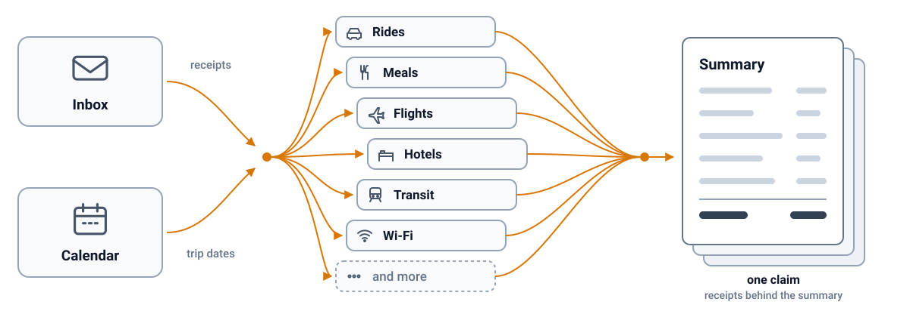

<h1 align="center">🧾 tidy-inbox</h1>

<p align="center">
  <b>Your money went out. Bring it back.</b>
  <br>
  Turn a week of receipts into one claim.
</p>

<p align="center">
  <a href="SKILL.md"></a>
  <a href="../../LICENSE"></a>
</p>

<p align="center">
  <sub>Runs on</sub>
  <br>
  <a href="#quick-start"></a>
  <a href="#quick-start"></a>
  <a href="#quick-start"></a>
</p>

<p align="center"></p>

<p align="center">
  <b><a href="SKILL.md">See the skill it documents</a></b>
</p>

You spent your own money on someone else's behalf. An interview, a client trip, a contract gig. Now the receipts are scattered across your inbox and the claim is the last thing you have time to build.

tidy-inbox builds it. Every receipt, the right total, one claim.

## Features

- **Finding**
  - Reads the trip dates from your calendar, or asks once
  - Searches the inbox for that window only
- **Deciding**
  - Shows the candidate list before anything is built
  - Takes corrections in plain words
- **Delivering**
  - One summary, then every receipt behind it
  - Nothing is sent anywhere. You send it.

## Quick start

```bash
npx skills add owner/tidy-inbox -g
```

Then tell your agent: "Build my claim for the trip on June 11."

## Configuration and security

What leaves your machine: nothing.

| Concern | What happens | Guard |
|---|---|---|
| Your inbox | Read through the agent's own mail tool, never copied out | the agent's permissions |
| The claim | Written to a folder you name | you send it |

## Common workflows

| Situation | What you say | What comes back |
|---|---|---|
| A trip last month | "Build my claim for the Denver trip" | Candidates in chat, then one claim |
| A receipt got missed | "Add the Tuesday dinner" | The claim rebuilt with it |
| Company paid some of it | "The flight was on the corporate card" | Those lines dropped, total corrected |

## For agents

- Read [SKILL.md](SKILL.md) first. The four steps there are the whole contract.
- Never send the claim. Hand it back and stop.
